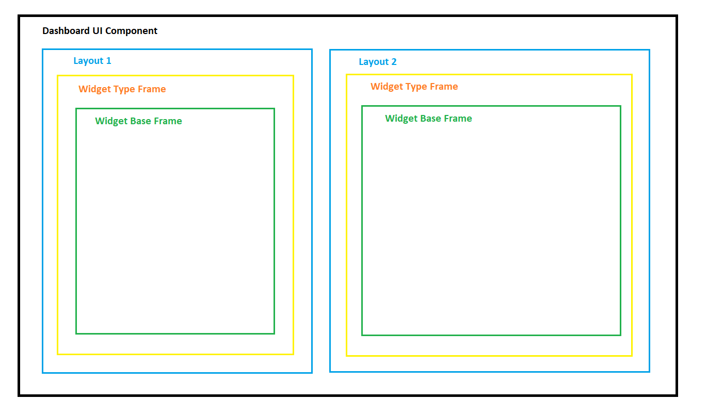
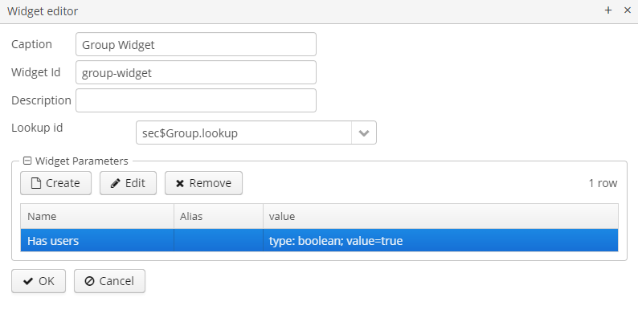
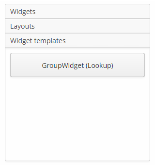
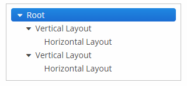
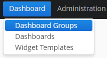

[](http://www.apache.org/licenses/LICENSE-2.0)

# 1. Introduction 
This component is designed to create and embed dashboards. Dashboard consists of widgets - individual elements based on a frame.
The widgets can be positioned inside a dashboard using vertical, horizontal and grid layouts.

# 1.1 Dashboard Structure



# 2. Installation 

The complete add-ons installation guide see in [CUBA Platform documentation](https://doc.cuba-platform.com/manual-latest/app_components_usage.html).

## 2.1. Add the Repository and the Component in CUBA Studio

1. Edit **Project properties** and on the **App components** panel click the **plus** button next to **Custom components**.

2. Paste the add-on coordinates in the coordinates field as follows: `group:name:version`. For example:
	
    com.audimex.dashboard:dashboard-global:2.0.0

Select the add-on version compatible with the CUBA platform version used in your project:

| Platform Version  | Component Version |
|-------------------|-------------------|
| 6.9.X             | 1.0.+             |
| 6.10.X            | 2.0.+             |

3. Click **OK** in the dialog. Studio will try to find the add-on binaries in the repository currently selected for the project. If it is found, the dialog will close and the add-on will appear in the list of custom components.

4. Save the project properties by clicking **OK**.

## 2.2. Add the Repository and the Component in build.gradle

1. Edit `build.gradle` and specify the add-on coordinates in the root `dependencies` section:

```groovy
dependencies {
    appComponent("com.haulmont.cuba:cuba-global:$cubaVersion")
    // your add-ons go here
    appComponent("com.audimex.dashboard:dashboard-global:2.0.0")
}
```

2. Execute `gradlew idea` in the command line to include add-on in your project’s development environment.

3. Edit `web.xml` files of the **core** and **web** modules and add the add-on identifier (which is equal to Maven `groupId`) to the space-separated list of application components in the `appComponents` context parameter:

```xml
<context-param>
    <param-name>appComponents</param-name>
    <param-value>com.haulmont.cuba com.audimex.dashboard</param-value>
</context-param>
```

# 3. Screens

## 3.1. Widget Template Browser

This screen allows creating, editing and removing widget templates. Widget templates are stored in a database. This screen is available from the application menu.


## 3.2. Widget Editor

This screen allows editing a widget and consists of the following elements:

- the **Name** field;
- the **Group** drop-down;
- the checkbox to set the widget visibility;
- the **Widget Type** lookup field;
- the **Customize** button.


When the user clicks the **Customize** button, the enhanced widget editor is opened, consisting of the following elements:

- the **Caption** field;
- the **Widget id** field;
- the **Description** field;
- depending on the selected **Widget Type**, one of the following fields will be displayed: 
  - **Screen id**, for any frame;
  - **Lookup id**, for the frames inherited from the `com.haulmont.cuba.gui.components.AbstractLookup`. Widgets of this type fire `WidgetEntitiesSelectedEvent` which contains the selected entities;  
- the frame with widget parameters which allows adding, editing and removing widget parameters. These parameters are passed as input parameters for the frame, based on which the widget was taken. For more information on adding and editing parameters, see [3.3. Parameter Editor](#33-Parameter Editor).



## 3.3. Parameter Editor

This screen allows editing a parameter. A parameter is a key-value pair, where the name field is the key and the value field is a value.
A value can have the following types:
```
    ENTITY("ENTITY"), contains fields metaClass, entityId, view
    LIST_ENTITY("LIST ENTITY"), a collection of parameters with the type ENTITY
    ENUM("ENUM"), contains the field emunClass
    DATE("DATE")
    DATETIME("DATETIME")
    TIME("TIME")
    UUID("UUID")
    INTEGER("INTEGER")
    STRING("STRING")
    DECIMAL("DECIMAL")
    BOOLEAN("BOOLEAN")
    LONG("LONG")
    UNDEFINED("UNDEFINED")
```


## 3.4. Persistent Dashboards

This screen allows creating, editing and removing dashboards in a database.


## 3.5. Dashboard Editor

This screen allows editing a dashboard.


Dashboard Editor contains 5 areas:
- the dashboard fields;
- the dashboard parameters;
- the palette with widgets and layouts;
- the tree representation of the edited dashboard structure
- the canvas  where the position of dashboard elements (widgets and layouts) is specified;
- the buttons panel.

### 3.5.1. Dashboard Fields

- **Title** - the name of the dashboard;
- **Code** - the unique identifier for a more convenient search in a database;
- **Refresh period** - the time period in seconds for refresh a dashboard UI;
- **Assistant bean name** - an optional reference to a Spring bean class that should be used for customizing the dashboard. 
- **Group** - the dashboard group;
- **Is available for all users** - a flag which defines the user access to the dashboard. If set to `false`, then only the user who created the dashboard can view and edit it. Otherwise, all users can view and edit the dashboard.

### 3.5.2. Dashboard Parameters

The frame with dashboard parameters which allows adding, editing and removing dashboard parameters. These parameters are passed as input parameters for the widgets in this dashboard. For more information on adding and editing parameters, see [3.3. Parameter Editor](#33-Parameter Editor).

### 3.5.3. Palette

It is a container with 3 collapsible tabs. Each tab contains a container with components. When a component is dragged to the canvas, the corresponding element is added to the canvas.

#### 3.5.3.1 Widgets

Contains **Lookup** and **Screen** widgets. Drag and drop an element from the palette for adding it on the canvas, and the widget editor will be opened in a dialog window. It is possible to make the widget a template (in this case, it is added to the tab **Widget Templates**). 


#### 3.5.3.2. Layouts

Contains horizontal, vertical, and grid layouts.


#### 3.5.3.3. Widget Templates

Contains widget templates from a database.



#### 3.5.3.4. Dashboad Layout Structure

Displays the current dashboard structure as a tree. The **Root** element is available by default and cannot be removed.



### 3.5.4. Canvas

It is a container in which you can place the widgets and layouts. Drag and drop an element from the palette for adding it on the canvas.


When dragging a grid layout to the canvas, a dialog opens where you can set the number of rows and columns. When dragging a widget, a **Widget Editor** dialog opens.


Example of the dashboard with widgets:


Click on a layout or a widget to select it. The selected element can contain buttons panel with the following buttons:


 - delete a container from the canvas;

 - open the **Widget Editor**; 

 - change the weight (expand ratio) of a container in a parent container.

### 3.5.5. Buttons Panel

- **OK** - save a dashboard and close the editor;
- **Cancel** - close the editor without saving a dashboard;
- **Propagate** - publish event `com.haulmont.addon.dashboard.web.events.DashboardUpdatedEvent`;
- **Export Json** - export a dashboard to a JSON file;
- **Import Json** - import a dashboard from a JSON file and refresh the editor. 

## 3.6 Dashboard Groups и Dashboard Group Editor

The screen **Dashboard Groups** allows creating, editing, and removing dashboard groups. The screen **Dashboard Group Editor** allows adding or excluding dashboards in a dashboard group from a database.
 
  
 
  
 
  

# 4. Integration of the Component Dashboard-UI

To use the `dashboard-ui` component in your screen, you need to add the special scheme `http://schemas.haulmont.com/cubadshb/ui-component.xsd` in the XML descriptor of the screen. Then add namespace like `dash` for the schema. The schema contains information about the tag `dashboard`, which can contain the `parameter` elements.

### Usage Example

```xml
<?xml version="1.0" encoding="UTF-8" standalone="no"?>
<window xmlns="http://schemas.haulmont.com/cuba/window.xsd"
        class="com.haulmont.example.web.SomeController"
        xmlns:dash="http://schemas.haulmont.com/cubadshb/ui-component.xsd">   
    ...
        <dash:dashboard id="dashboardId"
                        code="usersDashboard"
                        timerDelay="60">
             <dash:parameter name="role" value="Admin" type="string"/>           
        </dash:dashboard> 
    ...
```

#### Dashboard Tag Attributes

- `code` - the attribute which will serve for a dashboard search in a database;
- `jsonPath` - the `classPath` to the dashboard JSON file;
- `class` - the controller class of the `dashboard-ui` component which has to be inherited from `com.haulmont.addon.dashboard.web.dashboard.frames.uicomponent.WebDashboardFrame`;
- `timerDelay` - the time period in seconds for refresh a dashboard-ui.

***Note:*** when embedding a dashboard, you must specify the `code` or `jsonPath` attribute. When specifying at the same time, the attribute `code` takes precedence over `jsonPath`.

#### Parameter Tag Attributes

- `name` - the name of the parameter, required;
- `value` - the value of the parameter, required;
- `type` - the type of the value, can take one of the following values: boolean, date, dateTime, decimal, int, long, string, time, uuid.

***Note:*** by default, the parameter type is set to string.

# 5. Adding Additional Widget Types

To add an additional widget type, you need to do the following:

- Create a not persistent entity class which extends the class `com.haulmont.addon.dashboard.model.Widget`, then add the annotation `com.haulmont.addon.dashboard.annotation.WidgetType`. Fill the fields: `name`, `browseFrameId`, `editFrameId` in the annotation (see JavaDoc).
For example:

```java
@MetaClass(name = "dashboard$LookupWidget")
@WidgetType(name = CAPTION,
        browseFrameId = "lookupWidgetBrowse",
        editFrameId = "lookupWidgetEdit")
public class LookupWidget extends Widget {
    public static final String CAPTION = "Lookup";

    @MetaProperty
    protected String lookupWindowId;

    public String getLookupWindowId() {
        return lookupWindowId;
    }

    public void setLookupWindowId(String lookupWindowId) {
        this.lookupWindowId = lookupWindowId;
    }
}
```

- Add the not persistent entity class in `metadata.xml`;
- Add the frame for entity editing in the web module and register it in `web-screens.xml`. For example:

```xml
<?xml version="1.0" encoding="UTF-8" standalone="no"?>
<window xmlns="http://schemas.haulmont.com/cuba/window.xsd"
        class="com.haulmont.addon.dashboard.web.widget.lookup.LookupWidgetEdit">
    <layout spacing="true">
        <hbox id="lookupIdBox"
              spacing="true">
            <label width="85px"
                   value="msg://lookupId"/>
            <lookupField id="lookupIdLookup"
                         nullOptionVisible="false"
                         required="true"/>
        </hbox>
    </layout>
</window>
```

```java
public class LookupWidgetEdit extends AbstractFrame {
    @Inject
    protected LookupField lookupIdLookup;
    @Inject
    protected WindowConfig windowConfig;
    @Inject
    protected Metadata metadata;
    @Inject
    protected ScreenXmlLoader screenXmlLoader;

    protected Datasource<Widget> widgetDs;

    @Override
    public void init(Map<String, Object> params) {
        super.init(params);
        
        lookupIdLookup.setOptionsList(getAllLookupIds());
        lookupIdLookup.addValueChangeListener(e -> lookupIdSelected((String) e.getValue()));

        initWidgetDs(params);
        selectLookupId();
    }
    
     protected void initWidgetDs(Map<String, Object> params) {
            widgetDs = (Datasource<Widget>) params.get(ITEM_DS);
            Widget widget = widgetDs.getItem();
    
            if (!(widget instanceof LookupWidget)) {
                LookupWidget lookupWidget = metadata.create(LookupWidget.class);
                BeanUtils.copyProperties(widget, lookupWidget);
                widgetDs.setItem(lookupWidget);
            }
     }
}
```


- Add the frame for displaying the dashboard in the web module and add it in `web-screens.xml`. The controller class must be inherited from 
`com.haulmont.addon.dashboard.web.widget_types.AbstractWidgetBrowse`. For example:

```xml
<?xml version="1.0" encoding="UTF-8" standalone="no"?>
<window xmlns="http://schemas.haulmont.com/cuba/window.xsd"
        class="com.haulmont.addon.dashboard.web.widget.lookup.LookupWidgetBrowse">
    <layout spacing="true"
            width="100%"
            height="100%">
    </layout>
</window>
```

```java
public class LookupWidgetBrowse extends AbstractWidgetBrowse {
    @Inject
    protected Events events;

    protected AbstractLookup lookupFrame;

    @Override
    public void init(Map<String, Object> params) {
        super.init(params);
        refresh();
    }

    @Override
    public void refresh() {
        String lookupWindowId = ((LookupWidget) widget).getLookupWindowId();
        lookupFrame = openLookup(lookupWindowId, lookupHandler(), WindowManager.OpenType.DIALOG, getParamsForFrame());
        lookupFrame.close("");
        this.add(lookupFrame.getFrame());
    }

    protected Window.Lookup.Handler lookupHandler() {
        return items -> events.publish(new WidgetEntitiesSelectedEvent(new WidgetWithEntities(widget, items)));
    }
}
```