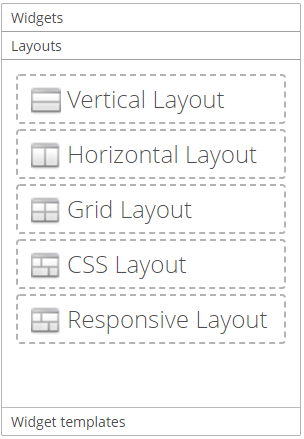
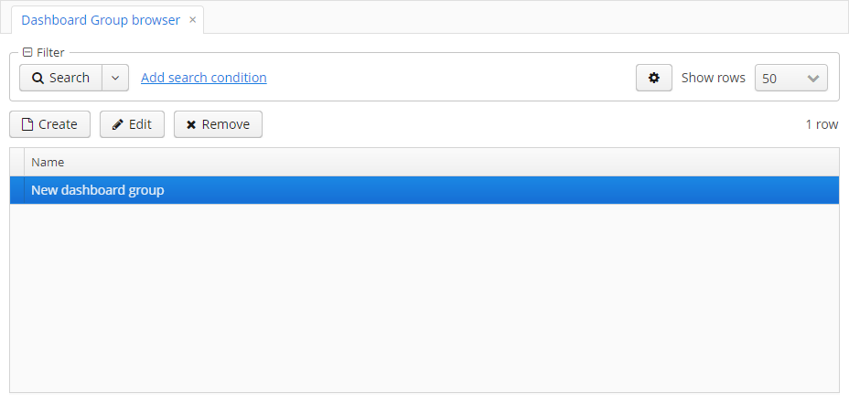
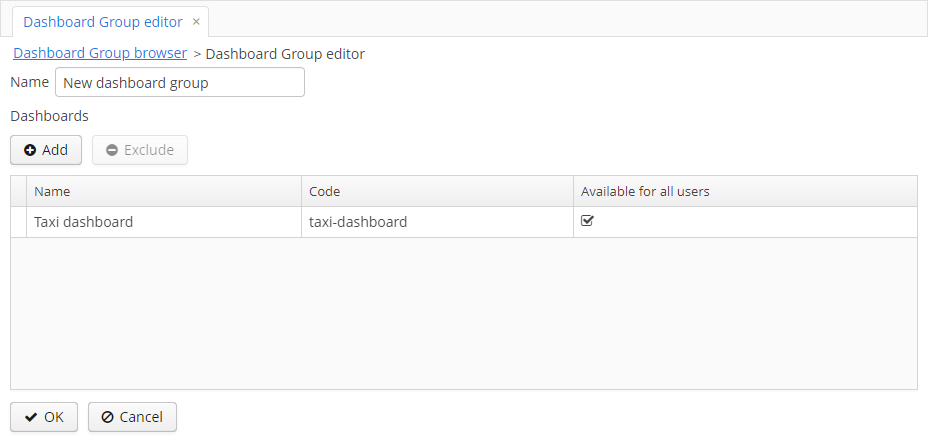

# 1. Introduction 
This component is designed to create and embed dashboards. Dashboard consists of widgets - individual elements based on a frame.
Placement of widgets inside a dashboard takes place using vertical, horizontal and grid layouts.

# 1.1 Dashboard structure


# 2. Installation 

## 2.1. Add the repository and the component in the CUBA Studio

## 2.2. Add the repository and the component in the build.gradle

# 3. Screens

## 3.1. Widget Template Browser

This screen allows to create, edit and remove widget templates. Widget templates stores in a database.


## 3.2. Widget Editor

This screen allows to edit a widget and consist of next elements:

- the field Caption;
- the field Description;
- the lookup field Widget Type. Exists next widget types by default: 
  - Screen, for any frame;
  - Lookup, for frames inherited from the com.haulmont.cuba.gui.components.AbstractLookup. Widgets with this type fire WidgetEntitiesSelectedEvent,
  which contains selected entities.
  
- An Area (a frame) specific to this widget type. More about this 
[5. Adding additional widget types](#5-Adding additional widget types);
- the frame with widget parameters, which allows to add, edit and remove widget parameters. These parameters are passed 
as input parameters for frame, based on which the widget was taken. About adding and editing parameters see [3.3. Parameter Editor](#33-Parameter Editor).


## 3.3. Parameter Editor

This screen allows to edit a parameter. A parameter is a key-value pair, where the name field is the key and the value field is a value.
A value can have the following types:
```
    ENTITY("ENTITY"), contains fields metaClass, entityId, view
    LIST_ENTITY("LIST_ENTITY"), a collection of parameters with the type ENTITY
    ENUM("ENUM"), contains the field emunClass
    DATE("DATE")
    DATETIME("DATETIME")
    TIME("TIME")
    UUID("UUID")
    INTEGER("INTEGER")
    STRING("STRING")
    DECIMAL("DECIMAL")
    BOOLEAN("BOOLEAN")
    LONG("LONG")
    UNDEFINED("UNDEFINED")
```


## 3.4. Persistence dashboards

This screen allows to create, edit and remove dashboards in a database.


## 3.5. Dashboard Editor

This screen allows to edit a dashboard.


Dashboard Editor contains from 5th areas:
- dashboard fields;
- dashboard parameters;
- the palette with widgets and layouts;
- the canvas,  where the placement of dashboard elements (widgets and layouts) is specified;
- the buttons panel.

### 3.5.1. Dashboard fields

- Title - a name of the dashboard;
- Reference name - a unique identifier for a more convenient search in a database
- Is available for all users - a flag, if set to false, then only the user can view and edit, who created the dashboard.
Otherwise, all users can view and edit the dashboard.

### 3.5.2. Dashboard parameters

The frame with dashboard parameters, which allows to add, edit and remove dashboard parameters.  These parameters are passed 
as input parameters widgets this dashboard. About adding and editing parameters see [3.3. Parameter Editor](#33-Parameter Editor).
смотрите [3.3. Parameter Editor](#33-Parameter Editor).

### 3.5.3. Palette

This is a container with 3 collapsible tabs. Each tab contains a container with components. When the component the is dragged to the canvas
the corresponding element is added to the canvas.

#### 3.5.3.1 Widgets

Contains a container in which you can add or exclude any widget. It is possible to make the widget a template (in this 
case, it is added to the tab Widget Templates). 


#### 3.5.3.2. Layouts

Contains horizontal, vertical, and grid layouts.



#### 3.5.3.3. Widget Templates

Contains widget templates from a database.


### 3.5.4. Canvas

It is the container in which you can placement widgets and layouts. Drag and drop an element from the palette for addition 
one on the canvas.


When dragging a grid layout to the canvas, a dialog opens in which you can set number of rows and columns.
When dragging a widget, a Widget Editor dialog opens.


Example the dashboard with widgets:


Click on a layout or a widget to select it. Selected element can contains buttons panel with following buttons:


 - delete an container from the canvas;

 - open Widget Editor; 

 - change weight (expand ratio) of a container in a parents container.

### 3.5.5. Buttons panel

- OK - save a dashboard and close the editor;
- Cancel - close the editor without saving a dashboard;
- Propagate - public event  com.audimex.dashboard.web.events.DashboardUpdatedEvent;
- Export Json - export a dashboard to a json file;
- Import Json - import a dashboard from a json file and refresh the editor. 

## 3.6 Dashboard Groups и Dashboard Group Editor

The screen Dashboard Groups allows to create, edit and remove dashboard groups. The screen Dashboard Group Editor 
allows to add or exclude dashboards in a dashboard group from a database.
 
  
 
  

# 4. Integration the component Dashboard-UI

To use the Dashboard-UI component in your screen, you need to add the special scheme "http://schemas.haulmont.com/cubadshb/ui-component.xsd" 
in the xml file of the screen. Then add namespace like 'dash' for the schema. The schema contains information about the tag 
'dashboard', which can contains elements 'parameter'.

### Example of use

```xml
<?xml version="1.0" encoding="UTF-8" standalone="no"?>
<window xmlns="http://schemas.haulmont.com/cuba/window.xsd"
        class="com.haulmont.example.web.SomeController"
        xmlns:dash="http://schemas.haulmont.com/cubadshb/ui-component.xsd">   
    ...
        <dash:dashboard id="dashboardId"
                        referenceName="usersDashboard">
             <dash:parameter name="role" value="Admin" type="string"/>           
        </dash:dashboard> 
    ...
```

#### Dashboard tag attributes

- referenceName - the attribute, which will be searched for a dashboard in a database.
- jsonPath - the classPath to the dashboard json file.
- class - the controller class of the dashboard-ui, one have to  inherited from he com.audimex.dashboard.web.dashboard.frames.ui_component.WebDashboardFrame

***Note:*** when embedding a dashboard, you must specify the referenceName or jsonPath attribute. When specifying at the same time, the attribute referenceName takes precedence over jsonPath.
#### Parameter tag attributes
- name - the name of parameter, required
- value - the value of parameter, required
- type - the type of the value, can take one of the following values: boolean, date, dateTime, decimal, int, long, string, time, uuid

***Note:*** by default the type of parameter sets as the string.

# 5. Adding additional widget types

To add the additional widget type, you need to do the following:

- add the not persistence entity class, which extends the class com.audimex.dashboard.model.Widget, then add the annotation
com.audimex.dashboard.annotation.WidgetType. Fill the fields name, browseFrameId, editFrameId in the annotation (see JavaDoc). 
Example:

```java
@MetaClass(name = "amxd$LookupWidget")
@WidgetType(name = CAPTION,
        browseFrameId = "lookupWidgetBrowse",
        editFrameId = "lookupWidgetEdit")
public class LookupWidget extends Widget {
    public static final String CAPTION = "Lookup";

    @MetaProperty
    protected String lookupWindowId;

    public String getLookupWindowId() {
        return lookupWindowId;
    }

    public void setLookupWindowId(String lookupWindowId) {
        this.lookupWindowId = lookupWindowId;
    }
}
```

- add the not persistence entity class in the metadata.xml
- add the frame for editing in the web module, add one in the web-screens.xml. Example:

```xml
<?xml version="1.0" encoding="UTF-8" standalone="no"?>
<window xmlns="http://schemas.haulmont.com/cuba/window.xsd"
        class="com.audimex.dashboard.web.widget_types.lookup.LookupWidgetEdit">
    <layout spacing="true">
        <hbox id="lookupIdBox"
              spacing="true">
            <label width="85px"
                   value="msg://lookupId"/>
            <lookupField id="lookupIdLookup"
                         nullOptionVisible="false"
                         required="true"/>
        </hbox>
    </layout>
</window>
```

```java
public class LookupWidgetEdit extends AbstractFrame {
    @Inject
    protected LookupField lookupIdLookup;
    @Inject
    protected WindowConfig windowConfig;
    @Inject
    protected Metadata metadata;
    @Inject
    protected ScreenXmlLoader screenXmlLoader;

    protected Datasource<Widget> widgetDs;

    @Override
    public void init(Map<String, Object> params) {
        super.init(params);
        
        lookupIdLookup.setOptionsList(getAllLookupIds());
        lookupIdLookup.addValueChangeListener(e -> lookupIdSelected((String) e.getValue()));

        initWidgetDs(params);
        selectLookupId();
    }
    
     protected void initWidgetDs(Map<String, Object> params) {
            widgetDs = (Datasource<Widget>) params.get(ITEM_DS);
            Widget widget = widgetDs.getItem();
    
            if (!(widget instanceof LookupWidget)) {
                LookupWidget lookupWidget = metadata.create(LookupWidget.class);
                BeanUtils.copyProperties(widget, lookupWidget);
                widgetDs.setItem(lookupWidget);
            }
     }
}
```


- add the frame for showing in the web module, add one in the web-screens.xml The class controller must be inherited from the class 
com.audimex.dashboard.web.widget_types.AbstractWidgetBrowse. Example: 

```xml
<?xml version="1.0" encoding="UTF-8" standalone="no"?>
<window xmlns="http://schemas.haulmont.com/cuba/window.xsd"
        class="com.audimex.dashboard.web.widget_types.lookup.LookupWidgetBrowse">
    <layout spacing="true"
            width="100%"
            height="100%">
    </layout>
</window>
```

```java
public class LookupWidgetBrowse extends AbstractWidgetBrowse {
    @Inject
    protected Events events;

    protected AbstractLookup lookupFrame;

    @Override
    public void init(Map<String, Object> params) {
        super.init(params);
        refresh();
    }

    @Override
    public void refresh() {
        String lookupWindowId = ((LookupWidget) widget).getLookupWindowId();
        lookupFrame = openLookup(lookupWindowId, lookupHandler(), WindowManager.OpenType.DIALOG, getParamsForFrame());
        lookupFrame.close("");
        this.add(lookupFrame.getFrame());
    }

    protected Window.Lookup.Handler lookupHandler() {
        return items -> events.publish(new WidgetEntitiesSelectedEvent(new WidgetWithEntities(widget, items)));
    }
}
```