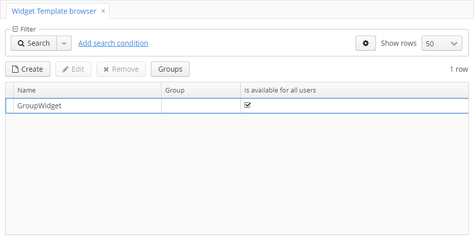
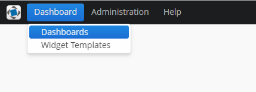

# 1. Введение 
Данный компонент предназначен для создания и внедрения дашбодов - визуальный интерфейс для отображения бизнес-процессов,
состоянии какого-либо объекта и т.п. Дашбоард состоит из виджетов - отдельные элементы, основанные на фрейме.
Размещение виджетов внутри дашборда происходит с помощью вертикального, горизонтального и сетчатого лайаутов.

# 2. Установка

## 2.1. Добавление репозитория и компонента через CUBA Studio

## 2.2. Добавление репозитория и компонента через файл build.gradle

# 3. Экраны

## 3.1 Widget Template Browser

Данный экран позволяет создавать, изменять и удалять шаблоны виджетов. Шаблоны виджетов храняться в базе данных.
В данный экран можно попасть из меню приложения. 




## 3.2 Widget Editor

Данный экран позволяет редактировать виджеты, он состоит из следующих элементов:

- поле Caption
- поле Description
- поле Widget Type. Позволяет выбрать к какому типу виджетов будет относится редактируемый Widget.
По умолчанию заданы следущие типы: 
  - Screen. Для любого фрейма.
  - Lookup. Для фреймов наследующихся от AbstractLookup. При выборе сущности на экране бросает эвент WidgetEntitiesSelectedEvent.
- Область (дополнительные поля и т.п.), характерная для данного типа виджета. Подробнее читайте 
[5. Добавление собственных тивов виджетов](#5-Добавление-собственных-тивов-виджетов).
- фрейм с параметрами виджета, позволяет добавлять, редактировать и удалять параметры виджета. Данные параметры передаются 
как входные параметры для фрейма, за основу которого был взят виджет. О добалении и редактировании параметров
смотрите [3.3. Parameter Editor](#33-Parameter Editor).


## 3.3 Parameter Editor

Данный фрейм позволяет редактировать параметры. Параметр работает как пара ключ-значение, где name - ключ, value - значение.
Значение может иметь следующие типы:
```
    ENTITY("ENTITY"), содержит поля metaClass, entityId, view
    LIST_ENTITY("LIST_ENTITY"), коллекция параметров ENTITY
    ENUM("ENUM"), содержит поле emunClass
    DATE("DATE")
    DATETIME("DATETIME")
    TIME("TIME")
    UUID("UUID")
    INTEGER("INTEGER")
    STRING("STRING")
    DECIMAL("DECIMAL")
    BOOLEAN("BOOLEAN")
    LONG("LONG")
    UNDEFINED("UNDEFINED")
```


## 3.4 Persistence dashboards

Данный экран позволяет создавать, изменять и удалять дашборды в базе данных. В данный экран можно попасть из меню приложения. 




## 3.5 Dashboard Editor

Данный фрейм позволяет редактировать дашборды.


Редактор состоит из 4 областей:
- поля дашборда
- параметры дашборда
- палитры с виджетами и лайаутами
- холста, где задается размещение элементов дашборда
- Панель с кнопками

### Поля даборда

- Title - название дашборда
- Reference name - уникальный идетификатор для более удобного поиска в базе данных
- Is available for all users - флаг, если установлен в false, то просматривать и редактировать может только пользователь,
создавший дашбоард. В противном случае проматривать и редактировать дашборд могут все пользователи

### Параметры дашборда

Фрейм с параметрами дашборда, позволяет добавлять, редактировать и удалять параметры дашборда. Данные параметры передаются 
как входные параметры для всех виджетов данного дашборда. О добалении и редактировании параметров
смотрите [3.3. Parameter Editor](#33-Parameter Editor).

### Палитра

Это контейнер с 3 сворачиваемыми вкладками. Каждая вкладка содержит контейнер с компонентами, при перетаскивании которых 
на холст добавляется соответствующий элемент.

#### Widgets

Содержит контейнер в который можно добавлять или удалять производьный виджет. Имеется возможность сделать виджет шаблоном. 
В этом случае он добавляется во вкладку Widget Templates. 


#### Layouts

Содержит горизонтальный, вертикальный и сетчатый лейауты.


#### Widget Templates

Содержит контейнер в который содежит шаблоны виджетов из базы данных.


### Холст

Это элемент в котором можно распологать виджеты с помощью лайаутов. Для того, чтобы добавить элемент, перетащите его 
из палитры.


При перетаскивании сетчатого лейаута на холст откроется диалог в котором можно выбрать количество строк и столбцов в создаваемом лейауте.
При перетаскивании виджета откроется диалог Widget Editor. Для добавления виджета нажмите ОК.


Пример дашборда с виджетами:


Каждый контейнер или виджет при выделении может содержать панель с кноками:


 - удалить контейнер из холста

 - открыть Widget Editor 

 - изменить вес (коэффициент расширения) контейнера в родительском контейнере

### Панель с кнопками

- OK - сохраняет изменения в дашборде и закрывает окно
- Cancel - закрывает окно без сохранения
- Propagate - публикует эвент DashboardUpdatedEvent.
- Export Json - Экспортирует модель дашборда в Json
- Import Json - импортирует Json дашборда и перерисовывает экран

## 3.6 Dashboard Groups и Dashboard Group Editor

 Экран Dashboard Groups позволяет создавать, изменять и удалять группы дашбордов. Экран Dashboard Group Editor 
 позволяет добавлять дашборды из базы данных в группу дашбордов.
 
  
 
  

# 4. Как добавить компонент Dashboard-UI

Для использования компонентов в XML необходимо в дескриптор экрана подключить файл схемы "http://schemas.haulmont.com/cubadshb/ui-component.xsd"
При подключении необходимо указать название пространства имен, которое будет содержать тэги компонентов, например, 
xmlns:dash="http://schemas.haulmont.com/webdav/ui-component.xsd".В данном примере пространство имен задается словом dash.

Схема содержит информацию о теге dashboard, который может вкючать в себя теги parameter.

### Пример использования

```xml
<?xml version="1.0" encoding="UTF-8" standalone="no"?>
<window xmlns="http://schemas.haulmont.com/cuba/window.xsd"
        class="com.haulmont.example.web.SomeController"
        xmlns:dash="http://schemas.haulmont.com/cubadshb/ui-component.xsd">   
    ...
        <dash:dashboard id="dashboardId"
                        referenceName="usersDashboard"
                        referenceName="usersDashboard"
                        timerDelay="60">
             <dash:parameter name="role" value="Admin" type="string"/>           
        </dash:dashboard> 
    ...
```

#### Аттрибуты тега dashboard

- referenceName - аттрибут, по которому будет вестисть поиск дашборда в базе данных.
- jsonPath - classPath до json дашборда.
- class - класс контроллера дашборда, должен быть наследован от com.audimex.dashboard.web.dashboard.frames.ui_component.WebDashboardFrame
- timerDelay - переод времени в секундах, при котором дашборд будет обновляться.

***Замечание:*** при встаивании дашборда обязательно необходимо указать аттрибут referenceName или jsonPath. При задании 
одновременно двух referenceName имеет приоритет выше, чем jsonPath.

#### Аттрибуты тега parameter
- name - имя параметра, обязательный аттрибут
- value - значение параметра, обязательный аттрибут
- type - тип параметра, может принимать одно из следующих значений: boolean, date, dateTime, decimal, int, long, string, time, uuid

***Замечание:*** по умолчанию тип параметра устанавливается string


# 5. Добавление собственных тивов виджетов

Для добавления собственного типа виджета необходимо сделать следующие шаги:

- Добавить неперсистетную сущносить, расширяющию класс Widget, добавить к ней аннотацию 
com.audimex.dashboard.annotation.WidgetType. В аннотации заполнить поля name, browseFrameId, editFrameId (см. JavaDoc). 
Пример:

```java
@MetaClass(name = "amxd$LookupWidget")
@WidgetType(name = CAPTION,
        browseFrameId = "lookupWidgetBrowse",
        editFrameId = "lookupWidgetEdit")
public class LookupWidget extends Widget {
    public static final String CAPTION = "Lookup";

    @MetaProperty
    protected String lookupWindowId;

    public String getLookupWindowId() {
        return lookupWindowId;
    }

    public void setLookupWindowId(String lookupWindowId) {
        this.lookupWindowId = lookupWindowId;
    }
}
```

- Добавить класс сущности в metadata.xml
- Добавить фрейм для редактирования полей сущности, зарегистрировать его в web-screens.xml. Пример:

```xml
<?xml version="1.0" encoding="UTF-8" standalone="no"?>
<window xmlns="http://schemas.haulmont.com/cuba/window.xsd"
        class="com.audimex.dashboard.web.widget_types.lookup.LookupWidgetEdit">
    <layout spacing="true">
        <hbox id="lookupIdBox"
              spacing="true">
            <label width="85px"
                   value="msg://lookupId"/>
            <lookupField id="lookupIdLookup"
                         nullOptionVisible="false"
                         required="true"/>
        </hbox>
    </layout>
</window>
```

```java
public class LookupWidgetEdit extends AbstractFrame {
    @Inject
    protected LookupField lookupIdLookup;
    @Inject
    protected WindowConfig windowConfig;
    @Inject
    protected Metadata metadata;
    @Inject
    protected ScreenXmlLoader screenXmlLoader;

    protected Datasource<Widget> widgetDs;

    @Override
    public void init(Map<String, Object> params) {
        super.init(params);
        
        lookupIdLookup.setOptionsList(getAllLookupIds());
        lookupIdLookup.addValueChangeListener(e -> lookupIdSelected((String) e.getValue()));

        initWidgetDs(params);
        selectLookupId();
    }
    
     protected void initWidgetDs(Map<String, Object> params) {
            widgetDs = (Datasource<Widget>) params.get(ITEM_DS);
            Widget widget = widgetDs.getItem();
    
            if (!(widget instanceof LookupWidget)) {
                LookupWidget lookupWidget = metadata.create(LookupWidget.class);
                BeanUtils.copyProperties(widget, lookupWidget);
                widgetDs.setItem(lookupWidget);
            }
     }
}
```


- Добавить фрейм для просмотра дашборда, зарегистрировать его в web-screens.xml  Контроллер должен наследоваться от 
com.audimex.dashboard.web.widget_types.AbstractWidgetBrowse. Пример: 

```xml
<?xml version="1.0" encoding="UTF-8" standalone="no"?>
<window xmlns="http://schemas.haulmont.com/cuba/window.xsd"
        class="com.audimex.dashboard.web.widget_types.lookup.LookupWidgetBrowse">
    <layout spacing="true"
            width="100%"
            height="100%">
    </layout>
</window>
```

```java
public class LookupWidgetBrowse extends AbstractWidgetBrowse {
    @Inject
    protected Events events;

    protected AbstractLookup lookupFrame;

    @Override
    public void init(Map<String, Object> params) {
        super.init(params);
        refresh();
    }

    @Override
    public void refresh() {
        String lookupWindowId = ((LookupWidget) widget).getLookupWindowId();
        lookupFrame = openLookup(lookupWindowId, lookupHandler(), WindowManager.OpenType.DIALOG, getParamsForFrame());
        lookupFrame.close("");
        this.add(lookupFrame.getFrame());
    }

    protected Window.Lookup.Handler lookupHandler() {
        return items -> events.publish(new WidgetEntitiesSelectedEvent(new WidgetWithEntities(widget, items)));
    }
}
```