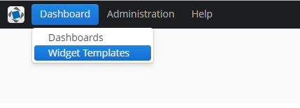

# 1. Введение 
Данный компонент предназначен для создания и внедрения дашбодов - визуальный интерфейс для отображения бизнес-процессов,
состоянии какого-либо объекта и т.п. Дашбоард состоит из виджетов - отдельные элементы, основанные на фрейме.
Размещение виджетов внутри дашборда происходит с помощью вертикального, горизонтального и сетчатого лайаутов.

# 2. Установка

## 2.1. Добавление репозитория и компонента через CUBA Studio

## 2.2. Добавление репозитория и компонента через файл build.gradle

# 3. Экраны

## 3.1 Widget Template Browser

Данный экран позволяет создавать, изменять и удалять шаблоны виджетов. Шаблоны виджетов храняться в базе данных.
В данный экран можно попасть из меню приложения. 




## 3.2 Widget Editor

Данный экран позволяет редактировать виджеты, он состоит из следующих элементов:

- поле Caption
- поле Description
- поле Widget Type. Позволяет выбрать к какому типу виджетов будет относится редактируемый Widget.
По умолчанию заданы следущие типы: 
  - Screen. Для любого фрейма.
  - Lookup. Для фреймов наследующихся от AbstractLookup. При выборе сущности на экране бросает эвент WidgetEntitiesSelectedEvent.
- Область (дополнительные поля и т.п.), характерная для данного типа виджета. Подробнее читайте 
[5. Добавление собственных тивов виджетов](#5-Добавление-собственных-тивов-виджетов).
- фрейм с параметрами виджета, позволяет добавлять, редактировать и удалять параметры виджета. Данные параметры передаются 
как входные параметры для фрейма, за основу которого был взят виджет. О добалении и редактировании параметров
смотрите [3.3. Parameter Editor](#33-Parameter Editor).


## 3.3 Parameter Editor

Данный фрейм позволяет редактировать параметры. Параметр работает как пара ключ-значение, где name - ключ, value - значение.
Значение может иметь следующие типы:
```
    ENTITY("ENTITY"), содержит поля metaClass, entityId, view
    LIST_ENTITY("LIST_ENTITY"), коллекция параметров ENTITY
    ENUM("ENUM"), содержит поле emunClass
    DATE("DATE")
    DATETIME("DATETIME")
    TIME("TIME")
    UUID("UUID")
    INTEGER("INTEGER")
    STRING("STRING")
    DECIMAL("DECIMAL")
    BOOLEAN("BOOLEAN")
    LONG("LONG")
    UNDEFINED("UNDEFINED")
```


## 3.4 Persistence dashboards

Данный экран позволяет создавать, изменять и удалять дашборды в базе данных. В данный экран можно попасть из меню приложения. 


## 3.5 Dashboard Editor

Данный фрейм позволяет редактировать дашборды.


Редактор состоит из 4 областей:
- поля дашборда
- параметры дашборда
- палитры с виджетами и лайаутами
- холста, где задается размещение элементов дашборда
- Панель с кнопками

### Поля даборда

- Title - название дашборда
- Reference name - уникальный идетификатор для более удобного поиска в базе данных
- Is available for all users - флаг, если установлен в false, то просматривать и редактировать может только пользователь,
создавший дашбоард. В противном случае проматривать и редактировать дашборд могут все пользователи

### Параметры дашборда

Фрейм с параметрами дашборда, позволяет добавлять, редактировать и удалять параметры дашборда. Данные параметры передаются 
как входные параметры для всех виджетов данного дашборда. О добалении и редактировании параметров
смотрите [3.3. Parameter Editor](#33-Parameter Editor).

### Палитра

Это контейнер с 3 сворачиваемыми вкладками. Каждая вкладка содержит контейнер с компонентами, при перетаскивании которых 
на холст добавляется соответствующий элемент.

#### Widgets

Содержит контейнер в который можно добавлять или удалять производьный виджет. Имеется возможность сделать виджет шаблоном. 
В этом случае он добавляется во вкладку Widget Templates. 


#### Layouts

Содержит горизонтальный, вертикальный и сетчатый лейауты.


#### Widget Templates

Содержит контейнер в который содежит шаблоны виджетов из базы данных.


### Холст

Это элемент в котором можно распологать виджеты с помощью лайаутов. Для того, чтобы добавить элемент, перетащите его 
из палитры.


При перетаскивании сетчатого лейаута на холст откроется диалог в котором можно выбрать количество строк и столбцов в создаваемом лейауте.
При перетаскивании виджета откроется диалог Widget Editor. Для добавления виджета нажмите ОК.


Пример дашборда с виджетами:


Каждый контейнер или виджет при выделении может содержать панель с кноками:


 - удалить контейнер из холста

 - открыть Widget Editor 

 - изменить вес (коэффициент расширения) контейнера в родительском контейнере

### Панель с кнопками

- OK - сохраняет изменения в дашборде и закрывает окно
- Cancel - закрывает окно без сохранения
- Propagate - публикует эвент DashboardUpdatedEvent.
- Export Json - Экспортирует модель дашборда в Json
- Import Json - импортирует Json дашборда и перерисовывает экран

## 3.6 Dashboard Groups и Dashboard Group Editor

# 4. Компонент Dashboard-UI

# 5. Добавление собственных тивов виджетов

# 6. Типы событий