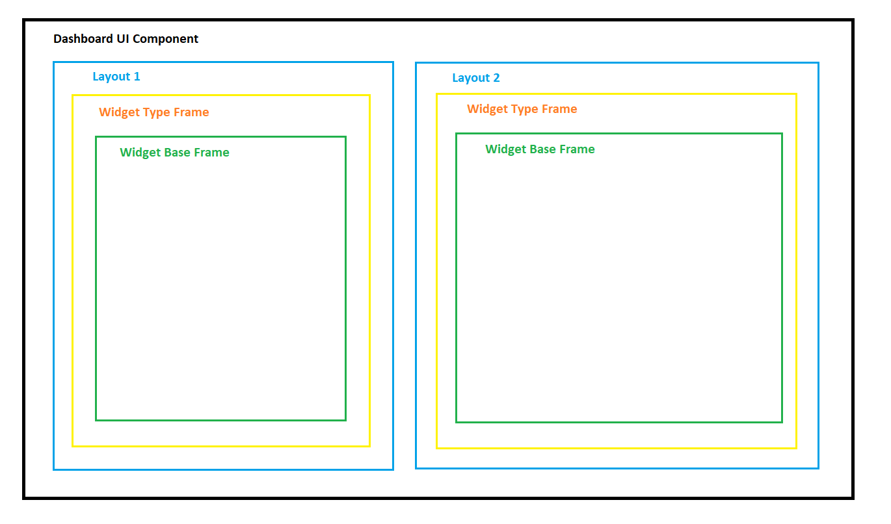
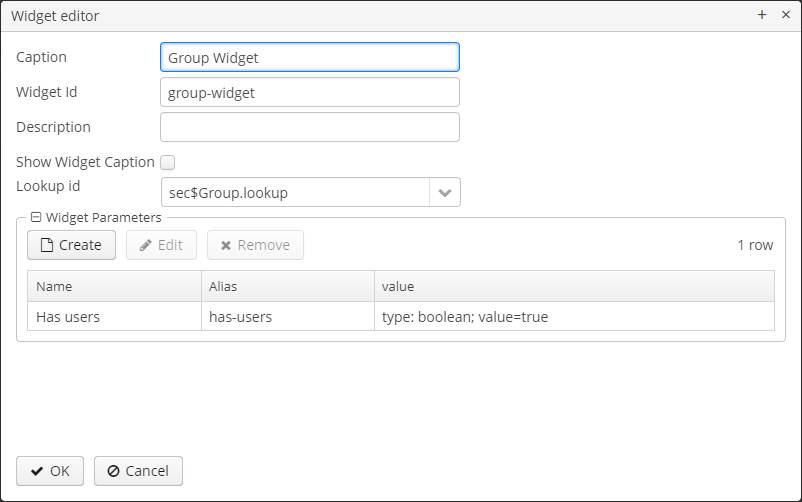
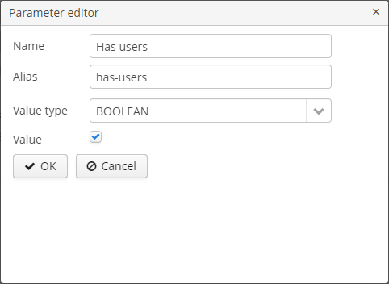
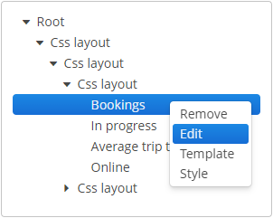
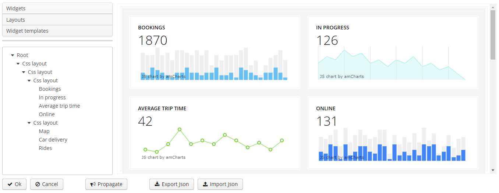
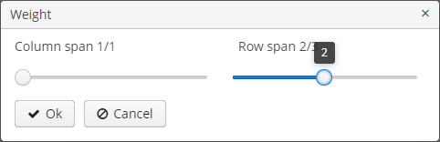

[](http://www.apache.org/licenses/LICENSE-2.0)

# 1. Введение 
Данный компонент предназначен для создания и внедрения дашбордов - визуального интерфейса для отображения бизнес-процессов, состояний какого-либо объекта и т.п. Дашборд состоит из виджетов - отдельных элементов, основанных на фрейме.
 Для размещения виджетов внутри дашборда используются вертикальная, горизонтальная и сетчатая компоновки (layout).
Чтобы попробовать дашборды в действии, вы можете скачать демо-проект [dashboard-addon-demo](https://https://github.com/cuba-platform/dashboard-addon-demo).

# 1.1 Структура дашборда



# 2. Установка

Подробную информацию об установке компонентов вы можете найти в [документации платформы CUBA](https://doc.cuba-platform.com/manual-latest/app_components_usage.html).

## 2.1. Добавление репозитория и компонента через CUBA Studio

1. Откройте экран **Project properties** и на панели **App components** нажмите на кнопку со знаком плюс рядом с **Custom components**.

2. Вставьте координаты аддона в поле координат компонента в формате: `group:name:version`. Например:
	
    com.audimex.dashboard:dashboard-global:2.0.0

Выберите версию дополнения, совместимую с версией платформы CUBA, используемой в проекте:

| Platform Version  | Component Version |
|-------------------|-------------------|
| 6.10.X            | 2.0.0            |
    
3. Нажмите **OK** в диалоговом окне. Studio попытается найти бинарные артефакты аддона в репозитории, используемом в проекте в настоящий момент. Если они найдены, диалоговое окно закроется, и аддон появится в списке собственных компонентов.

4. Сохраните изменения в свойствах проекта нажатием **OK**.

## 2.2. Добавление репозитория и компонента через файл build.gradle

1. Откройте файл `build.gradle` на редактирование и добавьте координаты аддона в секцию `dependencies`:

```groovy
dependencies {
    appComponent("com.haulmont.cuba:cuba-global:$cubaVersion")
    // your add-ons go here
    appComponent("com.audimex.dashboard:dashboard-global:2.0.0")
}
```

2. Выполните команду `gradlew idea` из командной строки, чтобы добавить аддон к окружению проекта.

3. Добавьте в файлы **web.xml** модулей **core** и **web** идентификатор аддона (он совпадает с Maven `groupId`) в параметр контекста `appComponents` к списку компонентов приложения, разделённому пробелами:

```xml
<context-param>
    <param-name>appComponents</param-name>
    <param-value>com.haulmont.cuba com.audimex.dashboard</param-value>
</context-param>
```

## 2.3. Расширение темы приложения

Для корректного отображения UI-компонентов дополнения рекомендуется расширить тему `halo` согласно инструкции в  [документации платформы](https://doc.cuba-platform.com/manual-latest/web_theme_extension.html).

# 3. Экраны

## 3.1 Widget Template Browser

Данный экран позволяет создавать, изменять и удалять шаблоны виджетов. Шаблоны виджетов позволяют повторно использовать уже настроенные виджеты. Шаблоны виджетов хранятся в базе данных.
В данный экран можно попасть из меню приложения. 


## 3.2 Widget Editor

Данный экран позволяет редактировать виджеты, он состоит из следующих элементов:

- поле **Name**;
- выпадающий список **Group**;
- поле **Widget Type**;
- кнопка **Customize**;
- чекбокс для управления видимостью виджета.


При нажатии кнопки **Customize** открывается диалоговое окно для расширенного редактирования виджета, содержащее следующие элементы:

- поле **Caption**;
- поле **Widget id**;
- поле **Description**;
- чекбокс **Show Widget Caption** для управления видимостью заголовка виджета;
- в зависимости от выбранного **Widget Type**, будет отображено одно из двух полей: 
  - **Screen id** - для любого фрейма;
  - **Lookup id** - для фреймов, наследующихся от `com.haulmont.cuba.gui.components.AbstractLookup`. При выборе сущности на экране публикуется событие `WidgetEntitiesSelectedEvent`;
- фрейм с параметрами виджета. Позволяет добавлять, редактировать и удалять параметры виджета. Данные параметры передаются как входные параметры для фрейма, за основу которого был взят виджет. О добалении и редактировании параметров
смотрите [3.3. Parameter Editor](#33-Parameter Editor).



## 3.3 Parameter Editor

Данный фрейм позволяет редактировать параметры. Параметр работает как пара ключ-значение, где `name` - ключ, `value` - значение.
Значение может иметь следующие типы:
```
    ENTITY("ENTITY"), содержит поля metaClass, entityId, view
    LIST_ENTITY("LIST ENTITY"), коллекция параметров ENTITY
    ENUM("ENUM"), содержит поле emunClass
    DATE("DATE")
    DATETIME("DATETIME")
    TIME("TIME")
    UUID("UUID")
    INTEGER("INTEGER")
    STRING("STRING")
    DECIMAL("DECIMAL")
    BOOLEAN("BOOLEAN")
    LONG("LONG")
```



## 3.4 Persistence Dashboards

Данный экран позволяет создавать, изменять и удалять дашборды в базе данных. В данный экран можно попасть из меню приложения. 


## 3.5 Dashboard Editor

Данный фрейм позволяет редактировать дашборды.


Редактор состоит из 5 областей:
- поля дашборда;
- параметры дашборда;
- палитра с виджетами и компоновками;
- структура элементов редактируемого дашборда в виде дерева;
- холст, где задается размещение элементов дашборда;
- панель с кнопками.

Холст и дерево элементов поддерживают перетаскивание элементов из палитры доступных компонентов.

### Поля дашборда

- **Title** - название дашборда;
- **Code** - уникальный идетификатор для более удобного поиска в базе данных;
- **Refresh period** - период времени в секундах, при котором дашборд будет обновляться;
- **Assistant bean name** - имя класса вспомогательного Spring-бина, который можно создать для более тонкой настойки дашборда (бин должен обязательно иметь скоуп **prototype**);
- **Group** - группа дашборда;
- **Is available for all users** - флаг, определяющий доступ пользователей к дашборду. Если установлено `false`, то просматривать и редактировать дашборд может только пользователь, его создавший. В противном случае, проматривать и редактировать дашборд могут все пользователи.

### Параметры дашборда

Фрейм с параметрами дашборда, который позволяет добавлять, редактировать и удалять параметры дашборда. Данные параметры передаются как входные параметры для всех виджетов данного дашборда. О добалении и редактировании параметров
смотрите [3.3. Parameter Editor](#33-Parameter Editor).

### Палитра

Это контейнер с 3 сворачиваемыми вкладками. Каждая вкладка содержит контейнер с компонентами, при перетаскивании которых на холст добавляется соответствующий элемент.

#### Widgets

Содержит виджеты **Lookup** и **Screen**. Для того чтобы добавить виджет на холст, перетащите его из палитры, после чего откроется диалоговое окно редактирования виджета.
Имеется возможность сделать виджет шаблоном. В этом случае он добавляется во вкладку **Widget Templates**. 


#### Layouts

Содержит горизонтальную, вертикальную, сетчатую и css компоновки (layout).


#### Widget Templates

Содержит контейнер, в котором находятся шаблоны виджетов из базы данных.


#### 3.5.3.4. Текущая компоновка

Отображает текущую структуру дашборда в виде дерева. Корневой элемент **Root** присутствует по умолчанию и не может быть удален.


Из контекстного меню для элементов дерева доступны следующие действия: 

- **Expand** - задает компонент внутри контейнера, который необходимо расширить на все доступное пространство в направлении размещения компонентов. Для контейнера с вертикальным размещением устанавливает компоненту 100% высоту, для контейнера с горизонтальным размещением - 100% ширину. Кроме того, при изменении размера контейнера изменять размер будет именно этот компонент.
- **Style** - позволяет указать имя стиля компонента и задать его ширину и высоту.
- **Remove** - удаляет компонент из структуры.
- **Weight** - изменяет вес (коэффициент расширения) контейнера в родительском контейнере.
- **Edit** - открывает редактор виджета.
- **Template** - открывает редактор шаблона виджета.

 

### Холст

Это элемент, в котором можно располагать виджеты с помощью компоновок. Для того чтобы добавить элемент, перетащите его из палитры.


При перетаскивании grid layout на холст откроется диалог, в котором можно выбрать количество строк и столбцов в создаваемой компоновке.
При перетаскивании виджета откроется диалог **Widget Editor**. Для добавления виджета нажмите ОК.

Пример дашборда с виджетами:



Каждый контейнер или виджет при выделении может содержать панель с кнопками:


 - удалить контейнер из холста;

 - открыть **Widget Editor**;

 - изменить вес (коэффициент расширения) контейнера в родительском контейнере, а также задать значения атрибутов `colspan` и `rowspan` для ячеек сетчатой компоновки :



 - изменить стиль контейнера: указать имя стиля, изменить ширину и высоту контейнера:


Подробнее об использовании стилей см. в [документации платформы](https://doc.cuba-platform.com/manual-latest-ru/web_theme_extension.html#web_theme_extension_styles).

### Панель с кнопками

- **OK** - сохраняет изменения в дашборде и закрывает окно;
- **Cancel** - закрывает окно без сохранения;
- **Propagate** - публикует событие `DashboardUpdatedEvent`;
- **Export Json** - экспортирует модель дашборда в JSON;
- **Import Json** - импортирует JSON дашборда и перерисовывает экран.

## 3.6 Dashboard Groups и Dashboard Group Editor

 Экран **Dashboard Groups** позволяет создавать, изменять и удалять группы дашбордов. Экран **Dashboard Group Editor** позволяет добавлять дашборды из базы данных в группу дашбордов.
 
  
 
  

# 4. Как добавить компонент Dashboard-UI

Для использования компонентов в XML необходимо в дескриптор экрана подключить файл схемы `http://schemas.haulmont.com/cubadshb/ui-component.xsd`. При подключении необходимо указать название пространства имен, которое будет содержать теги компонентов, например, 
`xmlns:dash="http://schemas.haulmont.com/webdav/ui-component.xsd`. В данном примере пространство имен задается словом `dashboard`.

Схема содержит информацию о теге `dashboard`, который может включать в себя теги `parameter`.

### Пример использования

```xml
<?xml version="1.0" encoding="UTF-8" standalone="no"?>
<window xmlns="http://schemas.haulmont.com/cuba/window.xsd"
        class="com.haulmont.example.web.SomeController"
        xmlns:dashboard="http://schemas.haulmont.com/cubadshb/ui-component.xsd">   
    ...
        <dashboard:dashboard id="dashboardId"
                        code="usersDashboard"
                        timerDelay="60">
             <dashboard:parameter name="role" value="Admin" type="string"/>           
        </dashboard:dashboard> 
    ...
```

#### Атрибуты тега dashboard

- `code` - атрибут, по которому будет вестись поиск дашборда в базе данных;
- `jsonPath` - `classPath` до JSON дашборда;
- `class` - класс контроллера дашборда, должен быть наследован от `com.haulmont.addon.dashboard.web.dashboard.frames.uicomponent.WebDashboardFrame`;
- `timerDelay` - период времени в секундах, при котором дашборд будет обновляться.

***Замечание:*** при встраивании дашборда обязательно необходимо указать атрибут `code` или `jsonPath`. Если заданы одновременно оба атрибута, `code` имеет приоритет выше, чем `jsonPath`.

#### Атрибуты тега parameter

- `name` - имя параметра, обязательный атрибут;
- `value` - значение параметра, обязательный атрибут;
- `type` - тип параметра, может принимать одно из следующих значений: boolean, date, dateTime, decimal, int, long, string, time, uuid.

***Замечание:*** по умолчанию тип параметра устанавливается string.


# 5. Добавление собственных типов виджетов

Для добавления собственного типа виджета необходимо выполнить следующие шаги:

- Создать фрейм ([документации платформы CUBA](https://doc.cuba-platform.com/manual-6.10/screens.html)), затем к фрейму добавить аннотацию `com.haulmont.addon.dashboard.web.annotation.DashboardWidget`. Заполнить поля: `name`, `editFrameId`(можно не заполнять, если не предполагается редактирование виджета) в аннотации (смотри JavaDoc).
`widget`, `dashboard`, `dashboardFrame` могут быть добавлены во фрейм виджета через аннотацию `@WindowParam`. Параметры виджета в виджет-фрейме должны иметь аннотации `@WidgetParam` и `@WindowParam`.
Пример:

```java
@DashboardWidget(name = CAPTION, editFrameId = "dashboard$LookupWidget.edit")
public class LookupWidget extends AbstractFrame implements RefreshableWidget {
    public static final String CAPTION = "Lookup";

    @WindowParam
    protected Widget widget;

    @WindowParam
    protected Dashboard dashboard;

    @WindowParam
    protected DashboardFrame dashboardFrame;

    @WidgetParam
    @WindowParam
    protected String lookupWindowId;    

    public String getLookupWindowId() {
        return lookupWindowId;
    }

    public void setLookupWindowId(String lookupWindowId) {
        this.lookupWindowId = lookupWindowId;
    }
}
```

- Добавить фрейм для редактирования виджета, зарегистрировать его в `web-screens.xml`. Пример:

```xml
<?xml version="1.0" encoding="UTF-8" standalone="no"?>
<window xmlns="http://schemas.haulmont.com/cuba/window.xsd"
        class="com.haulmont.addon.dashboard.web.widget.lookup.LookupWidgetEdit">
    <layout spacing="true">
        <hbox id="lookupIdBox"
              spacing="true">
            <label width="85px"
                   value="msg://lookupId"/>
            <lookupField id="lookupIdLookup"
                         nullOptionVisible="false"
                         required="true"/>
        </hbox>
    </layout>
</window>
```

```java
public class LookupWidgetEdit extends AbstractFrame {
    @Inject
    protected LookupField lookupIdLookup;
    @Inject
    protected WindowConfig windowConfig;
    @Inject
    protected Metadata metadata;
    @Inject
    protected ScreenXmlLoader screenXmlLoader;

    protected Datasource<Widget> widgetDs;

    protected Datasource<Widget> widgetDs;
    
    @WidgetParam
    @WindowParam
    protected String lookupWindowId;

    @Override
    public void init(Map<String, Object> params) {
        super.init(params);
        
        lookupIdLookup.setOptionsList(getAllLookupIds());
        lookupIdLookup.addValueChangeListener(e -> lookupIdSelected((String) e.getValue()));

        initWidgetDs(params);
        selectLookupId();
    }
    
    protected void initWidgetDs(Map<String, Object> params) {
        widgetDs = (Datasource<Widget>) params.get(WidgetEdit.ITEM_DS); 
    }
}
```

Если фрейм виджета реализует интерфейс `RefreshableWidget`, то метод `refresh()` будет вызываться автоматически при каждом обновленнии дашборда.